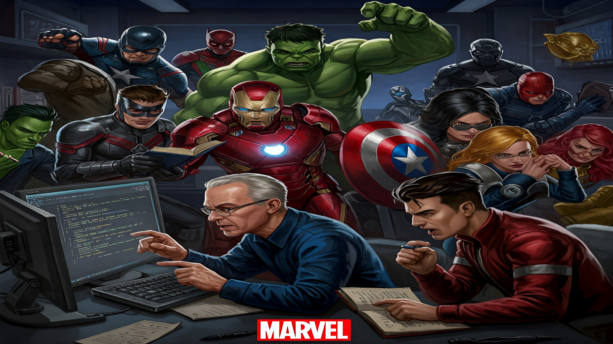

# 🚀 Semana do Zero ao Programador Contratado - Projeto Interativo **Marvel**

---

## 🧠 Sobre o Projeto  
Este é um projeto **interativo** e **responsivo**, criado como parte da *Semana do Zero ao Programador Contratado*. A proposta é unir o **aprendizado de desenvolvimento web** com uma dose de criatividade e cultura nerd, usando **personagens da Marvel** para representar perfis profissionais e analogias com o mundo da programação! 💻✨

---

## 🔥 Tema: Marvel x Programação  
| Herói                | Papel na Programação                         |
|----------------------|----------------------------------------------|
| 🧠 **Stan Lee**        | O Arquiteto das Ideias 💡                     |
| 🛠️ **Homem de Ferro** | O Engenheiro Fullstack 🔧                    |
| 🧭 **Capitão América** | O Gerente de Projetos 🧭                     |
| 💪 **Hulk**            | A Força Bruta do Computador ⚡              |
| 🌠 **Capitã Marvel**   | A Energia Cósmica dos Devs 🚀               |

---

## 🛠️ Tecnologias Utilizadas  
- HTML5  
- CSS3  
- JavaScript  
- Google Fonts  
- **Design Responsivo** (Mobile First)

---

## 🎯 Funcionalidades  
| Feature               | Descrição                                  |
|-----------------------|--------------------------------------------|
| 🌍 **Multi-moedas**    | Suporte a 160+ moedas via API              |
| ⚡ **Tempo real**      | Taxas atualizadas hourly                   |
| 🛡️ **Validação**       | Checagem de entradas inválidas             |
| 📊 **Logs**            | Registro de operações em arquivo           |

---

## 💡 Inspiração  
Inspirado na ideia de tornar o **aprendizado técnico mais divertido, simbólico e memorável**. A conexão entre **super-heróis e desenvolvimento web** transforma o estudo em uma experiência empolgante e visualmente envolvente! 💥

---

## 📸 Prévia do Projeto  

---

## 🦸‍♀️ Créditos  

Desenvolvido com 💙 por <strong>Sílvia Avelar</strong>

&nbsp;&nbsp;

Entre em contato ou veja outros projetos!

---
